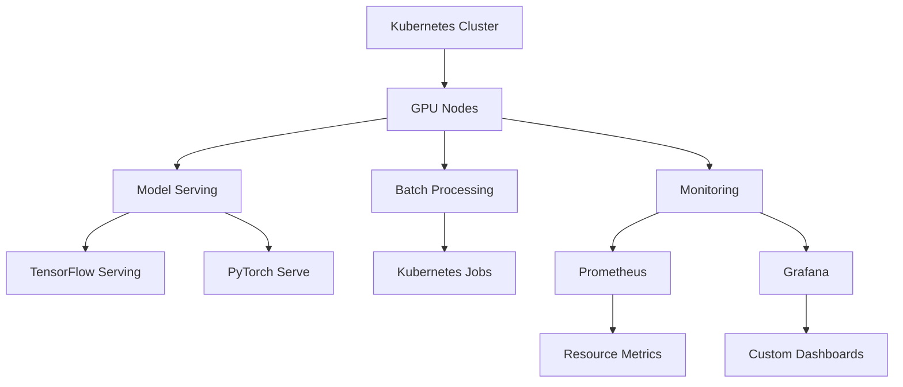

# Kubernetes AI Requirements

## Introduction
Kubernetes has become the de facto standard for container orchestration in cloud-native environments. As AI workloads grow in complexity, integrating AI with Kubernetes requires careful planning and specialized requirements. This guide outlines the key considerations for deploying AI applications on Kubernetes.

## Key Concepts
### 1. AI Workload Characteristics
AI workloads exhibit unique patterns that require specific Kubernetes configurations:
- **High CPU/GPU utilization**
- **Variable resource demands**
- **Latency-sensitive operations**
- **Data-intensive I/O patterns**

### 2. Kubernetes AI Architecture
A typical AI Kubernetes architecture includes:
- **Model Serving**: Deploying trained models as microservices
- **Batch Processing**: Handling large datasets with Kubernetes Jobs
- **Monitoring**: Real-time metrics for AI workloads
- **Auto-scaling**: Dynamic resource allocation based on workload

## Use Cases
### 1. Machine Learning Pipelines
- **Data Ingestion**: Kafka integration for real-time data streams
- **Feature Engineering**: Spark-based processing with Kubernetes Pods
- **Model Training**: Distributed training with Kubernetes Jobs
- **Model Serving**: TensorFlow Serving with GPU acceleration

### 2. Computer Vision Applications
- **Image Processing**: GPU-accelerated containers for image analysis
- **Object Detection**: Real-time inference with Kubernetes Deployments
- **Video Analytics**: Batch processing with Kubernetes CronJobs

### 3. Natural Language Processing
- **Text Analysis**: Distributed NLP pipelines with Kubernetes
- **Sentiment Analysis**: Real-time processing with GPU nodes
- **Language Modeling**: Large-scale training with Kubernetes Jobs

## Requirements Matrix
| Requirement Type | Description | Implementation |
|------------------|-------------|----------------|
| **Resource Allocation** | Ensure adequate CPU/GPU resources | Use Kubernetes Resource Requests/Limits |
| **Network Policies** | Secure communication between AI services | Implement NetworkPolicies and ServiceMesh |
| **Storage Requirements** | Persistent storage for model artifacts | Use PersistentVolumeClaims with CSI drivers |
| **Monitoring** | Real-time metrics for AI workloads | Integrate Prometheus + Grafana |
| **Security** | Secure AI pipelines | Implement RBAC, secret management, and encryption |

## Implementation Steps
1. **Cluster Setup**
   - Use GPU-enabled nodes for AI workloads
   - Enable metrics server for resource monitoring
   - Configure persistent storage class for model storage

2. **AI Service Deployment**
   - Create Kubernetes Deployments for model servers
   - Implement horizontal pod autoscaling
   - Set up service meshes for secure communication

3. **Monitoring and Observability**
   - Deploy Prometheus for metrics collection
   - Set up Grafana dashboards for AI-specific metrics
   - Implement logging with Fluentd/Elasticsearch

4. **Security Best Practices**
   - Use Kubernetes Network Policies
   - Implement secret management with Vault
   - Enable encryption for data at rest and in transit

## Tools and Technologies
### 1. AI Frameworks
- TensorFlow Serving
- PyTorch Serve
- ONNX Runtime
- FastAPI for model endpoints

### 2. Kubernetes Operators
- Kubeflow Operator
- Kserve Operator
- Prometheus Operator
- Istio Service Mesh

### 3. Monitoring Tools
- Prometheus
- Grafana
- Elasticsearch
- Kibana
- Datadog

## Example Architecture

## Best Practices
1. **Resource Management**
   - Use Kubernetes Horizontal Pod Autoscaler for AI workloads
   - Implement CPU/Memory limits to prevent resource starvation
   - Use GPU resource requests for machine learning jobs

2. **Security**
   - Use Kubernetes Network Policies to isolate AI services
   - Implement secret management for model credentials
   - Enable encryption for all data transfers

3. **Observability**
   - Set up custom metrics for model inference latency
   - Monitor GPU utilization for AI workloads
   - Implement logging for model training pipelines

4. **Scalability**
   - Use Kubernetes StatefulSets for persistent model storage
   - Implement auto-scaling for batch processing jobs
   - Use Kubernetes Operators for managed AI services

## Future Trends
1. **AI-Optimized Scheduling**
   - Intelligent scheduling of AI workloads based on resource availability
   - Dynamic allocation of GPU resources for different tasks

2. **Serverless AI**
   - Integration with Kubernetes Serverless Framework
   - Auto-scaling for sporadic AI requests

3. **Edge AI Integration**
   - Deploy AI models on edge nodes with Kubernetes
   - Real-time processing with edge computing capabilities

4. **AI-Driven DevOps**
   - Automated model deployment pipelines
   - AI-based anomaly detection in Kubernetes clusters

## Conclusion
Integrating AI with Kubernetes requires a comprehensive approach that addresses the unique needs of machine learning workloads. By following these requirements and best practices, organizations can build scalable, secure, and efficient AI infrastructure on Kubernetes. As AI technologies continue to evolve, the Kubernetes ecosystem will play a critical role in enabling next-generation intelligent applications.

# References
1. Kubernetes AI Best Practices (Kubernetes.io)
2. Kubeflow Documentation (kubeflow.org)
3. TensorFlow Serving Guide (tensorflow.org)
4. Prometheus Kubernetes Integration (prometheus.io)

## How to use

You are a platform engineer planning AI workloads on Kubernetes. Load this card to size
the cluster and lock in the four requirement areas: resources, networking, storage, security.
Map your `{{WORKLOAD_TYPE}}` (serving / batch / training) to the Requirements Matrix, then
follow the Implementation Steps. Gate the deployment against the Best Practices checklist.

## Related Artifacts
| Artifact | Relationship | Score |
|----------|-------------|-------|
| [[bld_knowledge_card_search_strategy]] | sibling | 0.26 |
| [[kubernetes-ai-requirement-builder]] | upstream | 0.21 |
| [[p11_fb_kubernetes_ai_requirement]] | downstream | 0.21 |
| [[bld_config_kubernetes_ai_requirement]] | related | 0.20 |
